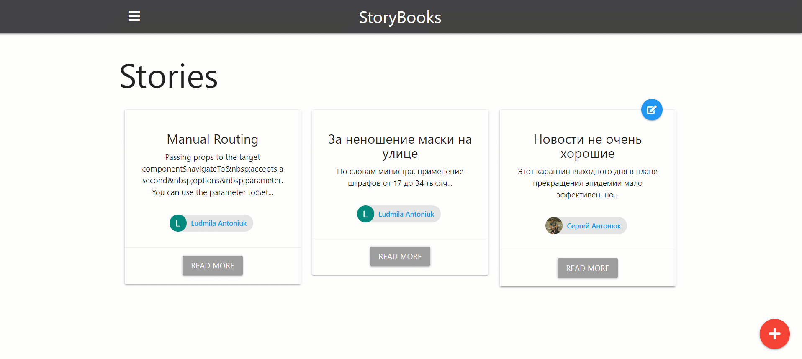

# StoryBooks

> Create public and private stories from your life

#### _Created using Node.js, Express, MongoDB with Google OAuth for authentication_

---



---

[Read more](./roadmap.md) about process creating an application

---

##### Usage

```
# Install dependencies
npm install

# Add your mongoDB URI and Google OAuth credentials to the config.env file

# Run in development
npm run dev

# Run in production
npm start
```

---
